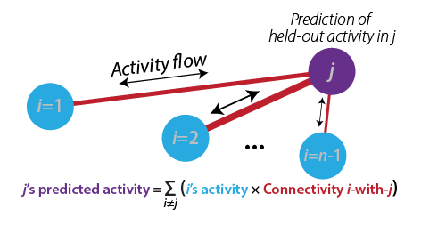
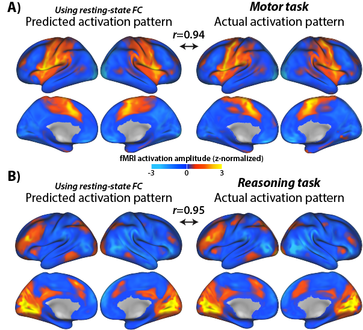
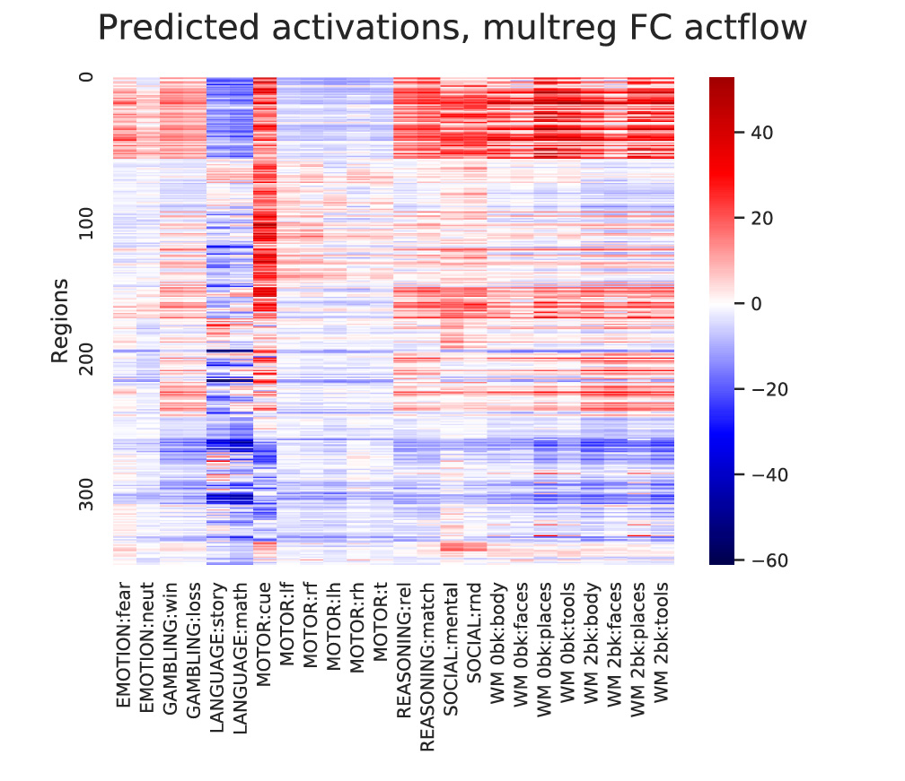
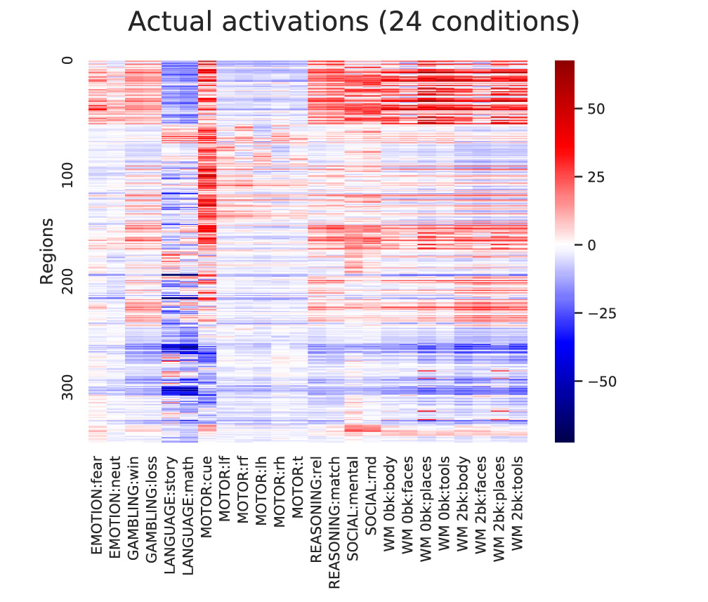

# ActflowToolbox
## The Brain Activity Flow ("Actflow") Toolbox

## Version 0.2.2 (beta version)

## Overview
This toolbox facilitates linking brain connectivity with cognitive/behavioral functions and task-evoked activity. The primary focus is on _activity flow mapping_ (http://rdcu.be/kOJq) and related methods such as _information transfer mapping_ (http://rdcu.be/wQ1M). These approaches can be used to create and test _network coding models_ (http://arxiv.org/abs/1907.03612), which are empirically-constrained neural network models.

Other included methods that can be used along with activity flow mapping (or not) include advanced versions of task-state functional connectivity, resting-state functional connectivity, and general linear modeling (multiple regression). Supporting methods such as preprocessing and simulations for validation will also be included [planned]. The primary focus (for now) is on fMRI and EEG/MEG data, but in principle these approaches can be applied to other kinds of data.

This code repository was created by the Cole Neurocognition Lab at Rutgers University: http://www.colelab.org/ We are happy for others to contribute to the code as well (contact Michael Cole if you are interested).

### Core algorithm and principles behind activity flow mapping
Activity flow mapping is a method validated and published in Nature Neuroscience in 2016 (see http://rdcu.be/kOJq), with multiple follow-up studies further validating the approach.

**Activity flow mapping has two basic steps**:
1) _Activity flow modeling_: Simulating the flow (movement) of activity between neural populations, using empirical data to estimate activity levels and routes of flow (connectivity). This is done by running the standard "propagation rule" and "activation rule" steps used in most neural network simulations (see http://arxiv.org/abs/1907.03612). In the standard approach each neural population's activity level is predicted based on the flow from every other recorded neural population (from http://rdcu.be/kOJq):



2) _Testing prediction accuracy_: The predicted brain activity pattern is compared to the actual recorded activity, providing evidence for or against the activity flow model used to make the predictions. Predictions of multiple models can be compared to quantify model validity. Two examples of predicted-to-actual accuracy testing (from http://rdcu.be/kOJq):



In principle, any measure of neural activity and any measure of neural connectivity can be used with activity flow mapping. Some modifications are necessary for fast temporal resolution data such as EEG/MEG or multi-unit recording, but these should be available soon (we are working on it!).

### Included connectivity mapping methods
* _All methods can be applied to resting-state or task-state data_
* Correlation-based functional connectivity
* Multiple-regression functional connectivity
	* Ordinary least squares multiple regression connectivity
	* Regularized multiple regression connectivity
		* Principle components regression connectivity (PCR)
* Partial-correlation functional connectivity
	* Inverse covariance-based partial correlation
	* Regularized partial correlation [planned]
* Special preprocessing for task-state functional connectivity
	* Flexible mean task-evoked response removal (http://www.colelab.org/pubs/ColeEtAl2019NeuroImage.pdf) (see FIR GLM preprocessing)
* Causal connectivity (fGES; https://doi.org/10.1007/s41060-016-0032-z) [planned]

### Preprocessing
* The toolbox is compatible with existing preprocessing software such as the HCP Pipelines (https://humanconnectome.org/software/hcp-mr-pipelines/) or fMRIPrep (https://fmriprep.readthedocs.io/en/stable/)
* Task functional connectivity:
	* Finite impulse response (FIR) regressed task data is recommended, which provides flexible mean task-evoked response removal for task-state functional connectivity (http://www.colelab.org/pubs/ColeEtAl2019NeuroImage.pdf). 
* We recommend empirically validated nusiance regression approaches for removing fMRI data artifacts, such as for resting-state functional connectivity (or task-state functional connectivity)
	* Example: The Ciric et al. (2017) validated preprocessing pipelines (https://www.sciencedirect.com/science/article/pii/S1053811917302288)

### Cite as:
1) Cole MW, Ito T, Bassett DS, Schultz DH (2016). "Activity flow over resting-state networks shapes cognitive task activations". Nature Neuroscience. 19:1718–1726.http://dx.doi.org/10.1038/nn.4406
2) https://github.com/ColeLab/ActflowToolbox/ 
and
3) The article that describes the specific toolbox functions being used in most detail

## How to install

git clone --recurse-submodules https://github.com/ColeLab/ActflowToolbox.git

## Email list/forum
We strongly encourage you to join the ColeNeuroLab Users Group (https://groups.google.com/forum/#!forum/coleneurolab_users), so you can be informed about major updates in this repository and others hosted by the Cole Neurocognition Lab.

## Conventions
* Data matrices all node X time
* Directed connectivity matrices all target X source
* Primary (default) brain parcellation: CAB-NP (https://github.com/ColeLab/ColeAnticevicNetPartition), which uses the Glasser2016 parcellation for cortex (https://balsa.wustl.edu/study/show/RVVG) and includes an additional 358 subcortical parcels. Cortex-only analyses with only the Glasser2016 parcels are easily implemented. Other parcellations can be used, and we anticipate integrating other parcellations in the future.

## Examples
A Jupyter Notebook with example analyses is viewable here: [HCP_example.ipynb](examples/HCP_example.ipynb)

Example of calculating activity flow mapping predictions using multiple-regression FC and standard task-evoked activations with fMRI data (in Python 3; assumes task activations and resting-state fMRI data are already loaded):
```
import ActflowToolbox as actflow
import numpy as np
import matplotlib.pyplot as plt
import seaborn as sns

restFC_mreg=np.zeros((np.shape(restdata)[0],np.shape(restdata)[0],np.shape(restdata)[2]))
for scount in np.arange(np.shape(restdata)[2]):
    restFC_mreg[:,:,scount]=actflow.connectivity_estimation.multregconn(restdata[:,:,scount])

print("==Activity flow mapping results, multiple-regression-based resting-state FC, 24 task conditions==")
actflowOutput_restFCMReg_bycond = actflow.actflowcomp.actflowtest(activations_bycond, restFC_mreg)
```
Output:
```
==Activity flow mapping results, multiple-regression-based resting-state FC, 24 task conditions==
===Comparing prediction accuracies between models (similarity between predicted and actual brain activation patterns)===
 
==Comparisons between predicted and actual activation patterns, across all conditions and nodes:==
--Compare-then-average (calculating prediction accuracies before cross-subject averaging):
Each comparison based on 24 conditions across 360 nodes, p-values based on 30 subjects (cross-subject variance in comparisons)
 
Mean Pearson r = 0.78, t-value vs. 0: 62.27, p-value vs. 0: 1.9635597302245892e-32
 
Mean % variance explained (R^2 score, coeff. of determination) = 0.57
 
Mean MAE (mean absolute error) = 7.54
 
Note: Pearson r and Pearson r^2 are scale-invariant, while R^2 and MAE are not. R^2 units: percentage of the to-be-predicted data's unscaled variance, ranging from negative infinity (because prediction errors can be arbitrarily large) to positive 1. See https://scikit-learn.org/stable/modules/generated/sklearn.metrics.r2_score.html for more info.
```

Visualizing the results:
```
#Visualize predicted and actual activation patterns, with multiple-regression FC
plt.figure(figsize=[7,5])
ax = sns.heatmap(np.mean(actflowOutput_restFCMReg_bycond['actPredVector_bytask_bysubj'],axis=2)[netorder,:],center=0,cmap='seismic',cbar=True,yticklabels=100,xticklabels=taskConditions)
ax.figure.suptitle('Predicted activations, multreg FC actflow')
ax.set(ylabel='Regions')

plt.figure(figsize=[7,5])
ax = sns.heatmap(np.mean(activations_bycond,axis=2)[netorder,:],center=0,cmap='seismic',cbar=True,yticklabels=100,xticklabels=taskConditions)
ax.figure.suptitle('Actual activations (24 conditions)')
ax.set(ylabel='Regions')
```
Output:<br>
<p float="left">
	
</p>

## Software development guidelines
* Primary language: Python 3
* Secondary language (for select functions, minimally maintained/updated): MATLAB
* Versioning guidelines: Semantic Versioning 2.0.0 (https://semver.org/); used loosely prior to v1.0.0, strictly after
* Using GitHub for version control
	* Those new to Git should go through a tutorial for branching, etc.: https://www.youtube.com/watch?v=oFYyTZwMyAg and https://guides.github.com/activities/hello-world/
	* Use branching for adding new features, making sure code isn't broken by changes
	* Considering using unit tests and Travis CI (https://travis-ci.org) in future
* Style specifications:
	* PEP8 style as general guidelines (loosely applied for now): https://www.python.org/dev/peps/pep-0008/
	* Soft tabs (4 spaces) for indentations [ideally set "soft tabs" setting in editor, so pressing tab key produces 4 spaces]
	* Use intuitive variable and function names
	* Add detailed comments to explain what code does (especially when not obvious)

## Publications that have used activity flow mapping and/or this toolbox
* Cole MW, Ito T, Bassett DS, Schultz DH (2016). "Activity flow over resting-state networks shapes cognitive task activations". Nature Neuroscience. 19:1718–1726.http://dx.doi.org/10.1038/nn.4406
* Ito T, Kulkarni KR, Schultz DH, Mill RD, Chen RH, Solomyak LI, Cole MW (2017). "Cognitive task information is transferred between brain regions via resting-state network topology". Nature Communications. 8:1027. http://dx.doi.org/10.1038/s41467-017-01000-w
* Mill RD, Gordon BA, Balota DA, Zacks JM, Cole MW (Preprint). "Predicting dysfunctional age-related task activations from resting-state network alterations". bioRxiv. https://doi.org/10.1101/678086

## Other related tools
* Information transfer mapping (https://github.com/ColeLab/informationtransfermapping)

## Contents
* _Directory_: actflowcomp - Calculating activity flow mapping
	* actflowcalc.py - Main function for calculating activity flow mapping predictions
	* actflowtest.py - A convenience function for calculating activity-flow-based predictions and testing prediction accuracies (across multiple subjects)
	* noiseceilingcalc.py - A convenience function for calculating the theoretical limit on activity-flow-based prediction accuracies (based on noise in the data being used)
* _Directory_: connectivity_estimation - Connectivity estimation methods
	* calcactivity_parcelwise_noncircular_surface.py: High-level function for calculating parcelwise actflow with parcels that are touching (e.g., the Glasser 2016 parcellation), focusing on task activations. This can create circularity in the actflow predictions due to spatial autocorrelation. This function excludes vertices within X mm (10 mm by default) of each to-be-predicted parcel.
	* calcconn_parcelwise_noncircular_surface.py: High-level function for calculating parcelwise actflow with parcels that are touching (e.g., the Glasser 2016 parcellation), focusing on connectivity estimation. This can create circularity in the actflow predictions due to spatial autocorrelation. This function excludes vertices within X mm (10 mm by default) of each to-be-predicted parcel.
	* corrcoefconn.py: Calculation of Pearson correlation functional connectivity
	* multregconn.py: Calculation of multiple-regression functional connectivity
	* partial_corrconn.py: Calculation of partial-correlation functional connectivity
	* pc_multregconn.py: Calculation of regularized multiple-regression functional connectivity using principle components regression (PCR). Useful when there are fewer time points than nodes, for instance.
* _Directory_: dependencies - Other packages Actflow Toolbox depends on
* _Directory_: examples - Example analyses that use the Actflow Toolbox (Jupyter notebook)
* _Directory_: images - Example images generated by the Actflow Toolbox
* _Directory_: matlab_code - Limited functions for activity flow mapping in MATLAB
	* PCmultregressionconnectivity.m - Compute multiple regression-based functional connectivity; PC allows for more regions/voxels than time points. 
	* actflowmapping.m - MATLAB version of actflowcalc.py; Main function for computing activity flow mapping predictions
	* multregressionconnectivity.m - Compute multiple regrression-based functional connectivity
* _Directory_: model_compare - Comparing prediction accuracies across models
	* model_compare_predicted_to_actual.py - Calculation of predictive model performance
	* model_compare.py - Reporting of model prediction performance, and comparison of prediction performance across models
* _Directory_: network_definitions - Data supporting parcel/region sets and network definitions
	* dilateParcels.py - Dilate individual parcels (cortex and subcortex) and produce masks to exclude vertices within 10 mm; requires Connectome workbench
* _Directory_: simulations - Simulations used for validating methods 
* _Directory_: tools - Miscellaneous tools
	* addNetColors.py - Generates a heatmap figure with The Cole-Anticevic Brain-wide Network Partition (CAB-NP) colors along axes
	* addNetColors_Seaborn.py - Generates a Seaborn heatmap figure with The Cole-Anticevic Brain-wide Network Partition (CAB-NP) colors along axes
	* map_to_surface.py - Maps 2D matrix data onto a dscalar surface file (64k vertices); uses Glasser et al. 2016 ROI parcellation
	* max_r.py - Permutation testing to control for FWE (as in Nichols & Holmes, 2002 max-t); individual difference correlations (r)
	* max_t.py - Permutation testing to control for FWE (as in Nichols & Holmes, 2002); t-test variants (t)
	* regression.py - Compute multiple linear regression (with L2 regularization option)

[//]: # (This is tracking code for keeping track of visits to the repo; MWC)
[](https://github.com/igrigorik/ga-beacon)
